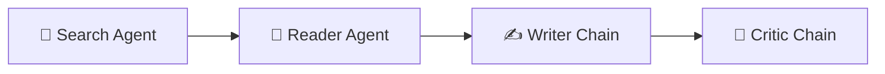

# 🧭 DigSearch — Multi-Agent Research Tool

> Ask a question. Get a sourced, critiqued research report — automatically.

**Status:** 🚧 Agent pipeline complete · Flask + HTML/CSS/JS frontend in progress (migrated from an earlier Streamlit prototype)

## Overview

DigSearch is a multi-agent AI research assistant that automates researching a topic end-to-end. Four agents run in sequence — each handing its output to the next — so you get a sourced, self-reviewed draft instead of a blank page.

## How it works



| Stage | Role |
|---|---|
| **Search** | Finds recent, reliable sources on the web for the given topic |
| **Read** | Scrapes and digests the single most relevant source in depth |
| **Write** | Drafts a structured report from the combined research |
| **Critique** | Reviews the draft and returns feedback on gaps, rigor, and clarity |

## Features

- End-to-end automated research pipeline (search → read → write → critique)
- Live progress updates in the UI as each agent completes its stage
- Google sign-in (via Clerk) required to run research
- Downloadable Markdown report
- Clean, reading-focused interface for the final output

## Tech stack

- **Agent pipeline:** Python, LangChain (agents + chains)
- **Backend:** Flask, Authlib (OpenID Connect), Server-Sent Events for live progress
- **Auth:** Clerk (Google OAuth via OIDC)
- **Frontend:** HTML, CSS, vanilla JavaScript

## Project structure

```
multi-agent-research-tool/
├── main.py                 # Flask app entry point — routes, auth, SSE endpoint
├── agents.py                # Search/Reader agents + Writer/Critic chains
├── pipeline.py               # Orchestrates the four-stage pipeline
├── tools.py                   # Tool functions used by the agents (search, scrape, etc.)
├── test_auth.py                # Auth flow tests
├── requirements.txt
├── runtime.txt
├── .env
├── .gitignore
├── templates/
│   ├── index.html
│   ├── about.html
│   └── research.html
└── static/
    ├── css/
    │   ├── style.css
    │   ├── home.css
    │   └── research.css
    └── js/
        ├── main.js
        ├── auth.js
        ├── research.js
        └── scroll-top.js
```

## Getting started

### Prerequisites
- Python 3.10+
- A Clerk application configured for OAuth/OIDC (client ID, client secret, and OIDC discovery URL)

### Installation
```bash
git clone https://github.com/<your-username>/digsearch.git
cd digsearch
python -m venv venv
source venv/bin/activate      # Windows: venv\Scripts\activate
pip install -r requirements.txt
```

### Environment variables
Create a `.env` file in the project root with:
```
FLASK_SECRET_KEY=
CLERK_CLIENT_ID=
CLERK_CLIENT_SECRET=
CLERK_SERVER_METADATA_URL=https://your-clerk-domain.clerk.accounts.dev/.well-known/openid-configuration
OAUTH_REDIRECT_URI=http://localhost:5000/oauth2callback
```
> `.env` is already covered by `.gitignore` — never commit it.

### Run
```bash
python main.py
```
Then visit `http://localhost:5000`.

## Usage

1. Open the Home page to see how the pipeline works.
2. Click **Start researching** — you'll be prompted to sign in with Google.
3. Enter a topic and run the pipeline; watch each of the four stages complete live.
4. Read the final report, or check the intermediate search results, scraped content, and critic feedback.
5. Download the report as Markdown.

## Roadmap

- [ ] Additional export formats (PDF, DOCX)
- [ ] Configurable source count (currently reads a single top result per run)
- [ ] Persisted research history per user
- [ ] Usage tiers beyond the current per-session demo cap

## License

MIT — feel free to use this as a reference for your own projects.

## Author

Built by **Abhijeet Kumar** — final-year CS student focused on AI/ML engineering.
